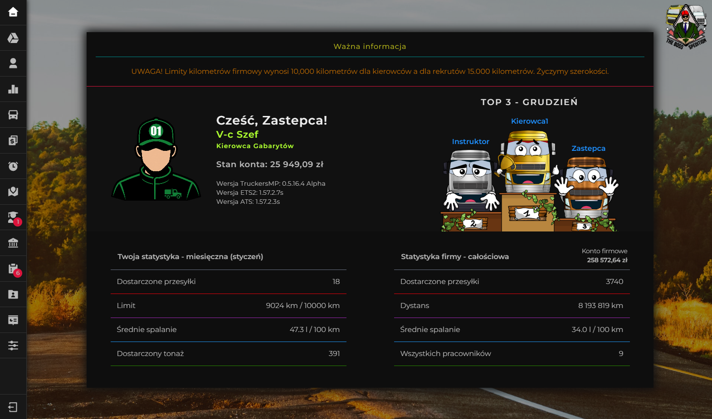

## Virtual Truck Spedition System
Virtual truck spedition system featuring an internal economy (perkilometer rates, license costs, fines), route reporting, absence requests, trailer permission management, route dispatcher module, account management, driver telemetry and Discord integration.
(Note: this system is made specially for desktop purposes, some components can lack of responsiveness)
### Available demo accounts at https://vtss.zakrzewski.dev
- Owner account - full access to every single functionality on the system:
  - login: `Wlasciciel`
  - password: `WlascicielDemo`

- Co-owner account - similiar to owner but cannot overwrite owner account details:
  - login: `Zastepca`
  - password: `ZastepcaDemo`

- User with ability to manage trailer permissions and review review route raports:
  - login: `Instruktor`
  - password: `InstruktorDemo`

- Regular user with ability to review route raports:
  - login: `Dyspozytor`
  - password: `DyspozytorDemo`

- Regular user:
  - login: `Kierowca`
  - password: `KierowcaDemo`

